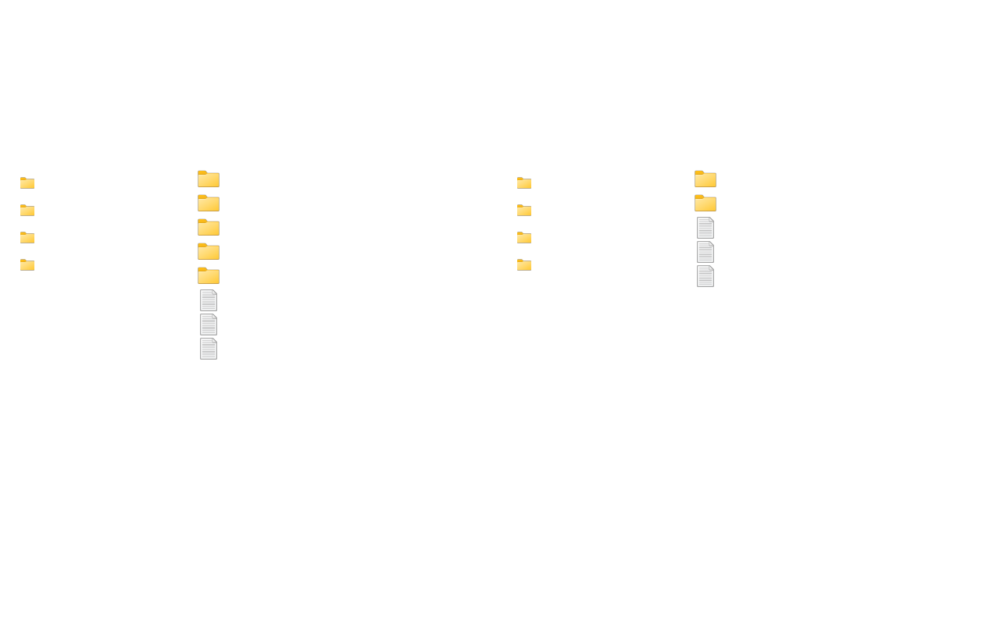
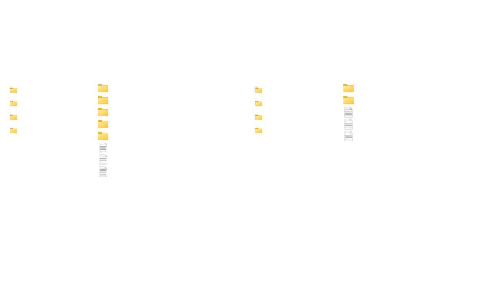
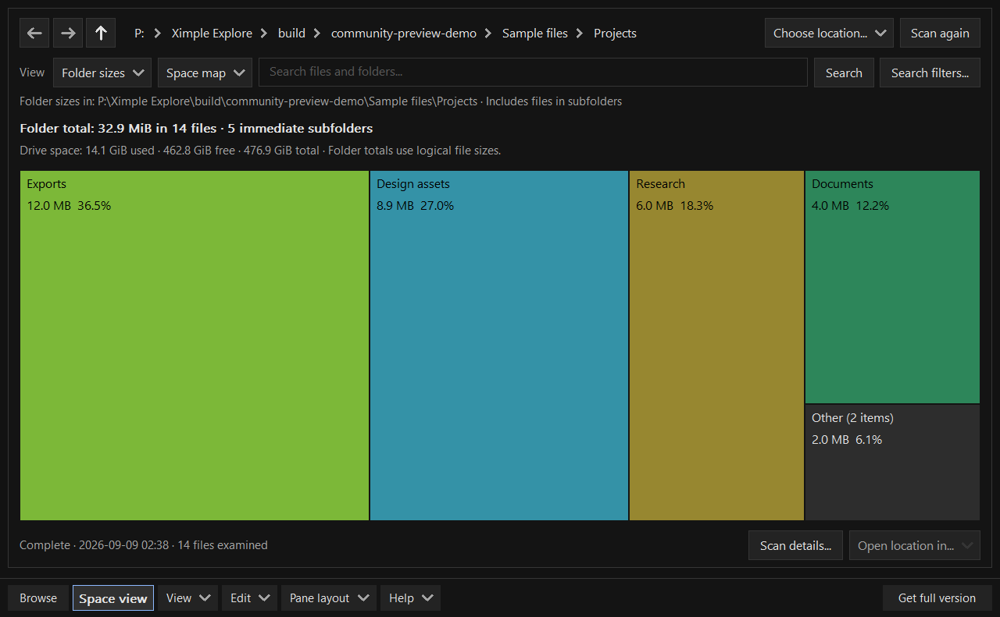

# Ximple Explorer

**Two places. One window.**

A native file manager for **Windows 11 x64**, with dual-pane navigation, independent tabs and built-in disk-space analysis.

**Free Development Preview · v0.9.12 · Portable · No signup to download**

[**Download the preview ZIP**](https://github.com/KaalBrown/ximple-explorer/releases/download/v0.9.12-preview/XimpleExplorer-0.9.12-preview-win11-x64.zip) · [Release notes and checksums](https://github.com/KaalBrown/ximple-explorer/releases/tag/v0.9.12-preview) · [Report a bug or share feedback](https://github.com/KaalBrown/ximple-explorer/issues/new/choose)

## A workspace for everyday files

| Dual-pane navigation | Independent tabs | Understand your disk space |
|---|---|---|
| Browse two locations and copy between them in one window. Switch between side-by-side and stacked layouts. | Keep folders available in each pane, with separate navigation history and customizable sidebars. | Inspect folder sizes, file types and large files in the integrated Space view. |

Ximple also includes recursive filename search, ZIP browsing and extraction, session undo/redo for eligible operations, light/dark themes and optional image thumbnails.

[**Watch the 24-second feature walkthrough**](https://github.com/KaalBrown/ximple-explorer/releases/download/v0.9.12-preview/XimpleExplorer-preview-demo.mp4)

The walkthrough and screenshots use sample files rendered by the current application. The walkthrough is a sequence of feature demonstrations, not a speed benchmark.

See the light theme and Space view

## Try the preview

1. Download **XimpleExplorer-0.9.12-preview-win11-x64.zip** from the release linked above. GitHub's automatically generated “Source code” archives contain this documentation, not the application.
2. Extract the ZIP and open **XimpleExplorer.exe**. No installer, administrator rights or separately installed .NET runtime are required.
3. Start with copies of files you can replace. Follow the [10-minute testing guide](TESTING.md), then tell us what worked and what got in your way.

The current executable is **unsigned**. Windows may display a publisher or reputation warning. Do not disable antivirus or other Windows protections to test it. If security software blocks it, stop and report the product and message shown. A SHA-256 checksum is supplied to check download integrity; it is not a security verdict or a publisher signature.

This is an unfinished development preview. Review the [known limitations](KNOWN-LIMITATIONS.md) before using it. Validation on a separate clean Windows 11 installation is still pending.

## Help shape the final release

I'm looking for the first **20–50 people** willing to try Ximple and share practical feedback. Navigation, copying, renaming, search and Space view are the most useful places to start.

- [Report a reproducible bug](https://github.com/KaalBrown/ximple-explorer/issues/new?template=bug-report.yml).
- [Share usability feedback or a feature request](https://github.com/KaalBrown/ximple-explorer/issues/new?template=feedback.yml).
- Comments on my community announcement posts are welcome too. GitHub requires an account to submit an issue; downloading Ximple does not.

Please include your Ximple version, Windows version, the steps you took, what you expected and what happened. Screenshots are optional. Remove private filenames, personal details and secrets before posting. File-operation failures and crashes take priority over new features; the [feedback guide](FEEDBACK.md) explains how reports are handled.

## Free preview, planned one-time purchase

The preview is free to download and test. The final product is planned as a small **one-time purchase, with no subscription**; the price and release date have not been set. The current preview has no automatic expiry. It does not include a promise of a free final-version license.

## About this repository

This is the official download and feedback repository maintained by [KaalBrown](https://github.com/KaalBrown). It contains public documentation and media, not the application's source code. Making these downloads available does not make the application open source.

Ximple is built in C++ using native Windows controls. Development and the application icon were assisted by OpenAI Codex and image-generation tools. Testing performed during development does not replace independent testing on other computers.

See [data and network behavior](DATA-AND-NETWORK.md), [known limitations](KNOWN-LIMITATIONS.md) and the third-party notices and licenses included in every download.
