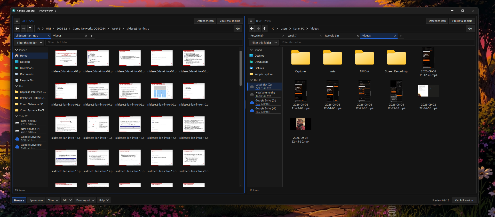
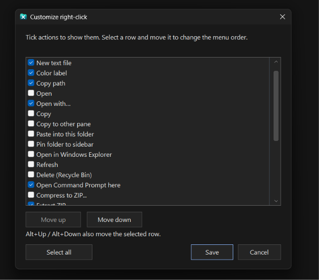
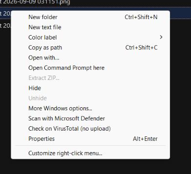
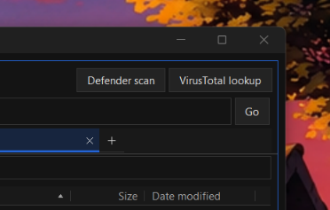
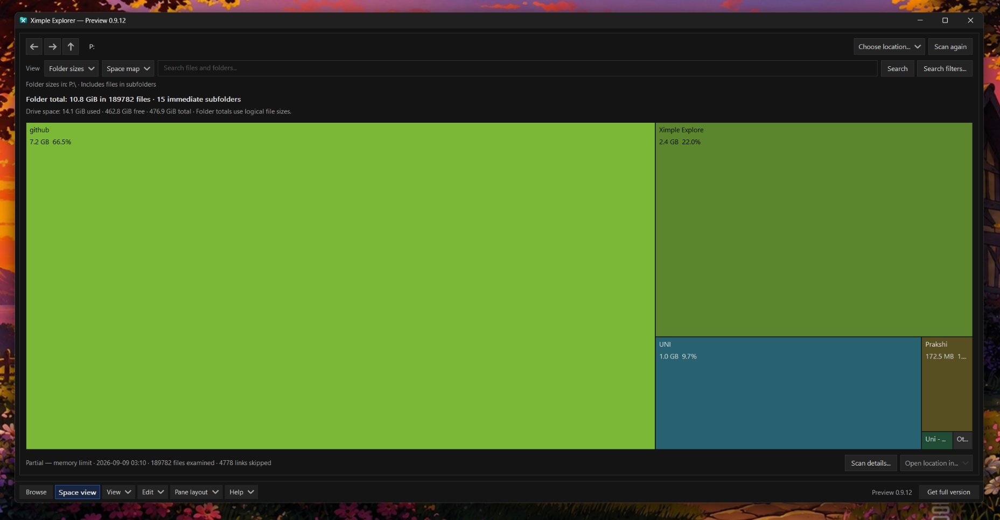
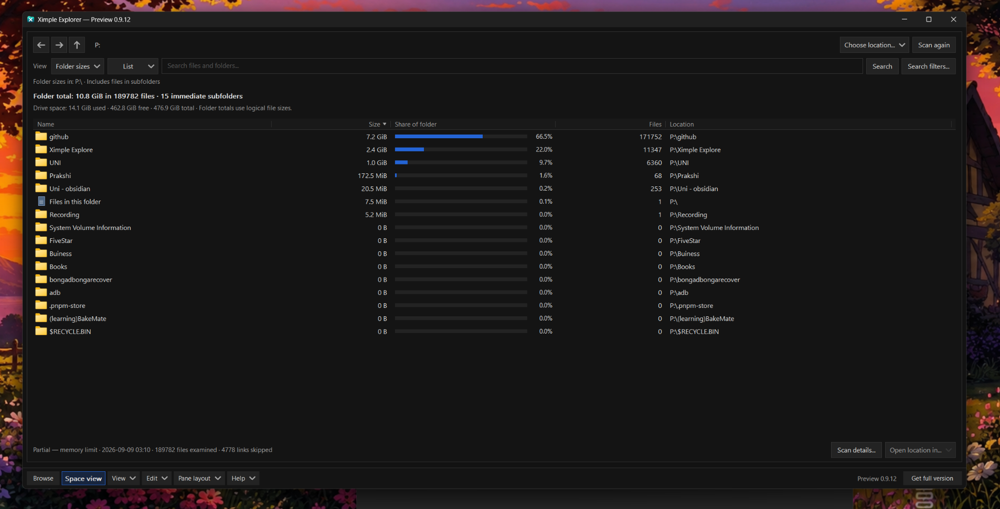
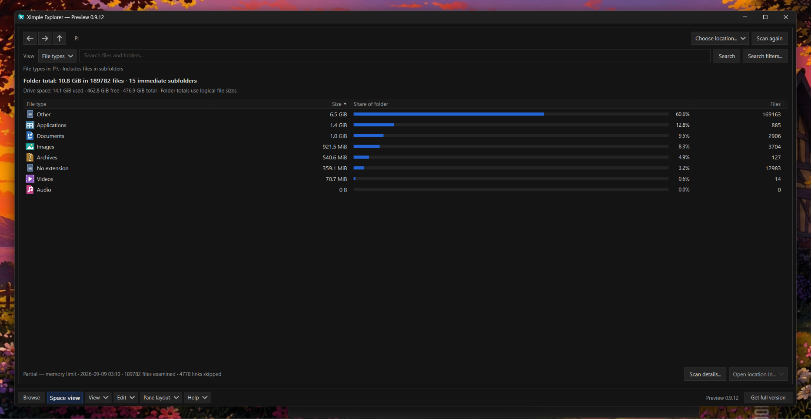

# Ximple Explorer

I always wanted an explorer with just enough useful features. Windows Explorer felt too simple in some places, and confusing and rigid in others. I missed having two panes, and copying things around often felt slower than it should. But I didn't want something overly complicated either, with a UI that looked like it was still living in the Windows 98 era.

So I made Ximple. It's the explorer I wanted to use myself.

**Free development preview · Windows 11 x64 · Portable · v0.9.12**

[**Download Ximple**](https://github.com/KaalBrown/ximple-explorer/releases/download/v0.9.12-preview/XimpleExplorer-0.9.12-preview-win11-x64.zip) · [Release notes and checksum](https://github.com/KaalBrown/ximple-explorer/releases/tag/v0.9.12-preview) · [Bugs and feedback](https://github.com/KaalBrown/ximple-explorer/issues/new/choose)

## Two places at once

The dual panels make it easy to drag and drop files between locations. Each panel has its own tabs and its own customizable sidebar, so I can keep different folders and groups handy on each side. I can move those groups around, rename shortcuts, resize the sidebars, or hide them when I want more room.

It comes in dark and light mode, with a customizable accent color. There are different file views, adjustable pane layouts, and color tags for files and folders. I can group files by their color tags or filter a folder to show just one color when I want to focus on a particular set of files.

There's also a Recycle Bin view built into the panes. I can look through deleted files and restore them without leaving Ximple.

## A right-click menu I can live with

I was always overwhelmed by cluttered right-click menus. Half the time I was looking through options I never used just to find the one I wanted.

In Ximple, I can choose which built-in file actions show up and change their order. Remove the clutter, move the useful stuff up, and keep the menu the way I like it. The same menu gives me color tagging and the file tools I use regularly.

  
  

## File checks from the explorer

I can start a Microsoft Defender scan of the current directory with one click. For a closer look at a file, there's a built-in VirusTotal lookup too. The lookup opens existing reports in the browser and doesn't automatically upload my files.

## Finding where the space went

Space view is where I do a bit of detective work. I can scan a directory, see which folders are taking up the most room, and switch to a space map to get a quick picture of where it's all going.

Sometimes I just want the numbers, or to see how much of a folder is made up of documents, images, applications and other file types.

Folder sizes and file types

Ximple can also save complete scans in its history and compare folder sizes between scans. That helps me see what's grown or changed over time, instead of trying to remember what was there last time.

## Small enough to carry around

There's fast filename search when I need to find something, without setting up a permanent disk index. I wanted the whole thing to stay lightweight and portable.

In my everyday use, I've seen it run at around **7 MB of memory**. That varies with what it's doing; scans, thumbnails and larger folders can use more. The app itself is roughly **2.3 MiB**, and the current ZIP download is about **1.2 MB**. Extract it and run it. No installer or separate .NET runtime needed.

[Watch the short feature walkthrough](https://github.com/KaalBrown/ximple-explorer/releases/download/v0.9.12-preview/XimpleExplorer-preview-demo.mp4). The video uses sample files; the screenshots here are from my own setup.

## Give it a try

This is still a development preview, and I'm looking for people to use it and tell me what feels good, what's confusing, and what breaks. I'd rather hear about an annoying everyday problem than guess what everyone needs.

Download **XimpleExplorer-0.9.12-preview-win11-x64.zip**, extract it, and open **XimpleExplorer.exe**. GitHub's automatic “Source code” downloads contain this documentation, not the app. No signup is needed to download.

The preview is currently unsigned, so Windows may show a warning. Keep your security protections on, and report it if the app is blocked. Start with copies of files you can replace. The [testing guide](TESTING.md) has a few things to try, and the [known limitations](KNOWN-LIMITATIONS.md) cover the rough edges. A separate clean Windows 11 test is still pending.

[Report a bug or leave feedback](https://github.com/KaalBrown/ximple-explorer/issues/new/choose), or reply wherever you found my announcement. Tell me your Ximple and Windows versions, what you tried, and what happened. Screenshots help, but aren't required.

The preview is free and has no automatic expiry. I'm planning a **one-time purchase for the final version, with no subscription**. I haven't decided the price or release date yet, and the preview doesn't include a final-version license.

Made by [KaalBrown](https://github.com/KaalBrown) in C++ with native Windows controls. This repository is for downloads and feedback; the application source stays private.

[Data and network behavior](DATA-AND-NETWORK.md) · [How feedback is handled](FEEDBACK.md)
